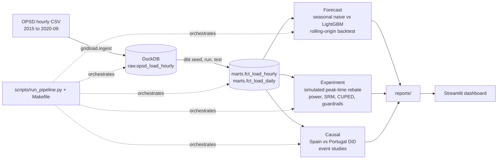

# gridload-demand-experiments

An end-to-end energy analytics pipeline on real hourly electricity load for Spain and Portugal: warehouse and tests in dbt on DuckDB, a day-ahead load forecast, a rigorous A/B analysis of a (simulated) demand-response programme, and a difference-in-differences study of Spain's March 2020 lockdown, served in a live Streamlit dashboard. Built by [katyayani-upadhyay](https://github.com/katyayani-upadhyay) as a portfolio project for analytics engineering and experimentation work in the power sector.

**Live dashboard: <https://gridload-demand-experiments.streamlit.app>**

## Architecture



## Problem framing

A system operator buys balancing energy for every megawatt-hour the day-ahead forecast gets wrong, and reserve procurement is sized to the forecast error distribution. On a system that peaks near 40 GW, one percentage point of weighted error is hundreds of MWh an hour at the peak, so the forecast section reports weighted absolute percentage error first and separates systematic bias from noise.

Demand-response programmes (peak-time rebates, smart-meter nudges) are sold on peak reductions that are small relative to household-to-household variation. Without a pre-registered decision rule, a sample-ratio check, variance reduction and guardrails for shifting and attrition, a programme can look successful while only moving load into the next hour or driving customers to opt out. The experiment section is a template for measuring that honestly.

## Results

All figures below are produced by `make all` on the OPSD release of 2020-10-06 and are read by the dashboard from `reports/`.

**Day-ahead hourly load forecast, Spain, rolling-origin backtest 2019-01-01 to 2020-09-30 (15,335 hours, refit every 28 days)**

| Model | WAPE | MAPE | Bias | WAPE 2019 | WAPE 2020 (Jan to Sep) |
|---|---|---|---|---|---|
| Seasonal naive (same hour, previous week) | 4.49% | 4.46% | +0.00% | 4.40% | 4.61% |
| LightGBM (lags, rolling stats, calendar, holidays) | **2.16%** | 2.21% | +0.33% | 1.98% | 2.41% |

LightGBM beats the baseline at every hour of the day; both models are worst in the 15:00 to 18:00 ramp. Per-hour metrics are in `reports/forecast_metrics_by_hour.csv`.

**Data quality (dbt):** 56 tests, 56 passing (100%), across 5 models and 1 seed. Tests include not-null, unique, accepted values, accepted ranges per country, a recency check against the documented release end, and two explicit DST tests on the local-time derivation.

**A/B experiment (simulated, 4,000 households, primary metric peak-window kWh per household-day)**

| Quantity | Value |
|---|---|
| Peak reduction, CUPED estimate | -0.191 kWh/day (-6.0%), 95% CI [-0.212, -0.171], p = 2e-74 |
| Peak reduction, plain difference in means | -0.177 kWh/day (-5.5%), 95% CI [-0.268, -0.085], p = 1.5e-4 |
| CUPED variance reduction | 94.7% (interval width 0.182 to 0.040 kWh/day) |
| Minimum detectable effect (alpha 0.05, power 0.8) | 0.133 kWh/day (4.2%); power at the planned 5% effect: 91.9% |
| Sample ratio mismatch | 2,010 vs 1,990, chi-square 0.10, p = 0.75, passed |
| Guardrails | total daily kWh -1.5% (pass), off-peak rebound +0.6% of off-peak, 21% of the peak reduction (pass), opt-out +1.9 points (pass) |
| Decision | Ship (`reports/ab_decision.md`); the simulator's true effect of 6% sits inside the CUPED interval |

**Lockdown difference-in-differences, Spain (treated) vs Portugal (control), 14 March to 30 April 2020**

| Quantity | Value |
|---|---|
| Differential effect on hourly load, year-over-year specification | **-2.17%**, 95% CI [-8.12%, +4.18%], p = 0.49 (5,806 hours, 36 country-week clusters) |
| Sensitivity: levels specification with hour, weekday, holiday fixed effects | -2.46%, 95% CI [-9.06%, +4.61%] |
| Weekly event study peak | -8.4% in the week of 30 March 2020, when Spain suspended all non-essential activity |
| Pre-trend slope 2015-01 to 2020-02 (seasonally adjusted gap) | -0.0063 log points per year; -0.0008 over the post window |
| Raw year-over-year change, 14 March to 30 April | Spain -13.8%, Portugal -9.4% |
| Published Spanish figures for comparison | -13.49% for 14 March to 30 April 2020 vs the five-year average (Santiago et al. 2021); -17.3% for April 2020 alone (Red Eléctrica); at least -15% weather-corrected during full lockdown (IEA) |

Spain's raw drop matches the published 11 to 13.5 percent range. The DiD is much smaller because Portugal locked down too: it measures only the part of Spain's decline that exceeded Portugal's, net of a 3-point gap that already existed in January to March 2020. Full write-up with the identifying assumption in `reports/did_results.md` and plot in `reports/did_event_study.png`.

## Tech stack

- **DuckDB** as the warehouse: a single file, no server, fast enough to scan the 130 MB OPSD CSV in three seconds, and it runs identically in CI.
- **dbt-core with dbt-duckdb** for staging, intermediate and mart layers with tests as code. Custom `accepted_range` and `recency` generic tests avoid a package dependency.
- **LightGBM** through its native API for the forecast; gradient-boosted trees handle the lag and calendar interactions without feature engineering by hand. Prophet was skipped deliberately: it cannot use lagged load.
- **scipy and statsmodels** for the t-tests, power analysis, CUPED and the clustered-SE OLS behind the DiD.
- **Streamlit and Plotly** for the dashboard, reading committed report artifacts so Community Cloud needs no warehouse.
- **pytest, ruff, GitHub Actions** for tests, lint and a CI run that ingests, runs `dbt build`, and executes a short forecast backtest on every push.

## Quickstart

```bash
git clone https://github.com/katyayani-upadhyay/gridload-demand-experiments.git
cd gridload-demand-experiments
cp .env.example .env
make setup                 # uv venv with Python 3.11 and all dependencies
make all                   # ingest -> dbt -> forecast -> experiment -> causal (about 5 minutes)
make pytest                # unit tests for forecasting, A/B statistics, DiD, dashboard
make dashboard             # http://localhost:8501
```

Individual steps: `make ingest`, `make transform`, `make test`, `make forecast`, `make experiment`, `make causal`. macOS needs `brew install libomp` for LightGBM.

## A documented failure: the DST bug

OPSD ships UTC and CET/CEST timestamps. The obvious shortcut is `utc + 1 hour` for Spain. I replaced the tz-aware conversion with that fixed offset to check the tests would notice: `assert_local_day_hour_counts_match_dst` failed on 22 local days (every DST transition day now had 24 hours instead of 23 or 25) and `assert_dst_transition_hours_explicit` failed on 34 hour rows (local hour 2 was no longer skipped in March or repeated in October). Portugal makes it worse: it is on WET/WEST, one hour behind Spain, so the skipped hour is 01:00 there and 02:00 in Madrid. The fix keeps UTC as the only key, derives local time with `timezone(tz, timezone('UTC', utc_ts))` per country from a seed table, and lets the two tests guard it.

## Limitations and honest notes

- **What is simulated.** Only the A/B experiment. There is no household data in OPSD; the households, their consumption, the 6 percent treatment effect and the opt-out rates come from a seeded simulator (`gridload/experiments/simulate.py`). Every artifact from that module says so. Forecasting and the DiD use real load data.
- **The DiD is a relative estimate.** Portugal declared its own state of emergency on 18 March 2020, so the control was treated too. The estimate is the differential effect of Spain's earlier and stricter lockdown, and its confidence interval includes zero. Weather is not controlled for, and two countries are too few for country-level clustering.
- **The OPSD release ends 30 September 2020.** It therefore cannot cover Spain's 1 June 2021 switch to the mandatory three-period time-of-use tariff (2.0TD), which is the natural next quasi-experiment for this pipeline: an event study of the hourly load shape around the tariff change with Portugal as control. Documented as a future extension.
- **Orchestration is a plain Python script.** Each step is a function taking a settings object, so wrapping them in an Airflow DAG is planned and mechanical, but Airflow is not set up here.
- **Forecast origin is local midnight,** so every lag is at least 24 hours. A market-realistic noon origin would push the shortest lag to 36 hours and raise the error somewhat.

## References

- Santiago, I., Moreno-Munoz, A., Quintero-Jiménez, P., Garcia-Torres, F., Gonzalez-Redondo, M.J. (2021). Electricity demand during pandemic times: The case of the COVID-19 in Spain. *Energy Policy* 148, 111964. <https://www.sciencedirect.com/science/article/pii/S0301421520306753>
- Red Eléctrica de España (May 2020). Demand for electricity in Spain falls 17.3% in April. <https://www.ree.es/en/press-office/news/press-release/2020/05/demand-electricity-spain-falls-17-3-percent-april>
- International Energy Agency (2020). Covid-19 impact on electricity. <https://www.iea.org/reports/covid-19-impact-on-electricity>
- Open Power System Data (2020). Time series package, version 2020-10-06. <https://data.open-power-system-data.org/time_series/2020-10-06/>
